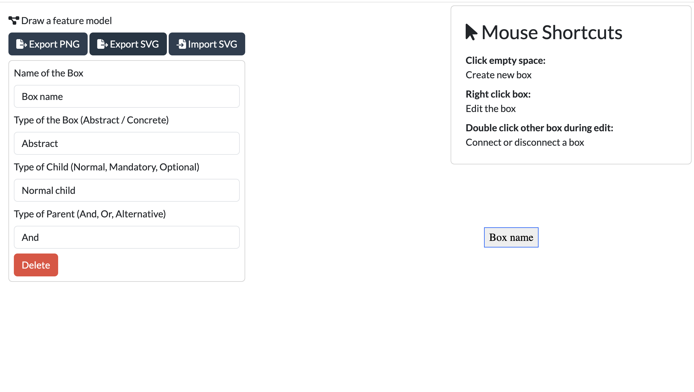

# HTML5 feature model diagram editor

A minimalistic feature model diagram editor... if it works for you, don't complain about the code quality ;)
Otherwise feel free to report bugs or improvements.

(You can use it here: https://evelance.de/online_feature_model_editor/index.htm)

